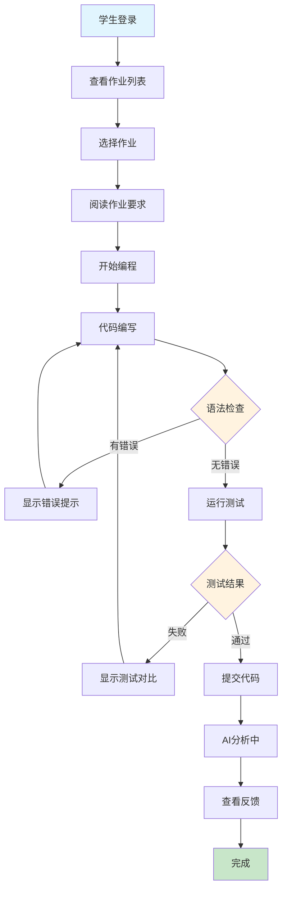
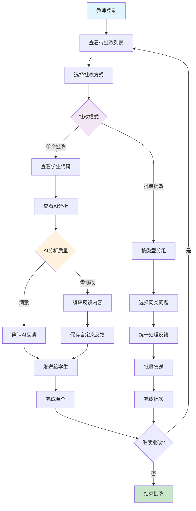

# AI教学助手系统 - UX流程图和Wireframes

## 1. 学生作业提交流程图



## 2. 教师批改反馈流程图



---

## 3. 界面Wireframes设计

### 3.1 学生作业提交界面

#### A. 作业概览页面
```
┌─────────────────────────────────────────────────────────────┐
│  🏠 AI教学助手 > 我的作业 > C语言基础                          │
├─────────────────────────────────────────────────────────────┤
│                                                             │
│  📝 作业：二分查找算法实现                [难度: ⭐⭐⭐]         │
│  📅 截止时间: 2025-09-20 23:59        [预计: 2小时]          │
│                                                             │
│  📋 作业要求:                                                │
│  ┌─────────────────────────────────────────────────────┐     │
│  │ 实现一个二分查找算法，在有序数组中查找目标值         │     │
│  │                                                   │     │
│  │ 要求：                                            │     │
│  │ • 时间复杂度: O(log n)                           │     │
│  │ • 处理边界情况                                   │     │
│  │ • 返回目标值的索引，未找到返回-1                  │     │
│  └─────────────────────────────────────────────────────┘     │
│                                                             │
│  🧪 测试用例预览: (3个测试用例)                                │
│  📎 参考资源: [算法教程] [C语言手册]                           │
│                                                             │
│              [开始编程] [查看历史提交]                         │
└─────────────────────────────────────────────────────────────┘
```

#### B. 代码编辑界面
```
┌─────────────────────────────────────────────────────────────┐
│  🏠 AI教学助手 > 作业提交 > 二分查找算法     [自动保存: 2秒前]   │
├─────────────────────────────────────────────────────────────┤
│                                                             │
│  ┌─────────────────┐  ┌─────────────────────────────────────┐ │
│  │    作业要求      │  │           代码编辑器                 │ │
│  │                │  │                                     │ │
│  │ 📝 实现二分查找   │  │  1  #include <stdio.h>             │ │
│  │                │  │  2                                  │ │
│  │ 🎯 要求：        │  │  3  int binarySearch(int arr[],     │ │
│  │ • O(log n)     │  │  4      int size, int target) {    │ │
│  │ • 边界处理      │  │  5      int left = 0;              │ │
│  │                │  │  6      int right = size - 1;      │ │
│  │ 🧪 测试用例：     │  │  7                                  │ │
│  │ [1,3,5,7,9]    │  │  8      while (left <= right) {    │ │
│  │ target: 5      │  │  9          int mid = left +        │ │
│  │ expect: 2      │  │ 10              (right-left)/2;     │ │
│  │                │  │ 11          if (arr[mid] == target) │ │
│  │ [展开更多测试]    │  │ 12              return mid;         │ │
│  │                │  │ 13          ...                     │ │
│  │ 💡 提示：        │  │                                     │ │
│  │ 使用while循环   │  │  [🎨主题] [💾保存] [▶运行] [📤提交]     │ │
│  └─────────────────┘  └─────────────────────────────────────┘ │
│                                                             │
│  ┌─────────────────────────────────────────────────────────┐ │
│  │                    测试结果面板                          │ │
│  │  ✅ 测试1: 通过  ✅ 测试2: 通过  ❌ 测试3: 失败           │ │
│  │                                                         │ │
│  │  💊 详细结果:                                            │ │
│  │  输入: [1,3,5,7,9], target: 10                         │ │
│  │  期望: -1                                              │ │
│  │  实际: 4                                               │ │
│  │  🔍 错误分析: 未正确处理目标值不存在的情况                  │ │
│  └─────────────────────────────────────────────────────────┘ │
└─────────────────────────────────────────────────────────────┘
```

#### C. 提交确认界面
```
┌─────────────────────────────────────────────────────────────┐
│                        提交作业确认                          │
├─────────────────────────────────────────────────────────────┤
│                                                             │
│  ✨ 恭喜！您的代码已通过所有测试用例                           │
│                                                             │
│  📊 代码质量预评估:                                          │
│  ├─ 语法正确性: ✅ 优秀                                        │
│  ├─ 逻辑完整性: ✅ 良好                                        │
│  ├─ 性能效率:   ✅ 符合要求                                    │
│  └─ 代码风格:   ⚠️  可改进                                    │
│                                                             │
│  💬 留言给老师 (可选):                                        │
│  ┌─────────────────────────────────────────────────────────┐ │
│  │ 这是我第一次实现二分查找，请老师指导...                   │ │
│  └─────────────────────────────────────────────────────────┘ │
│                                                             │
│  📋 提交清单:                                                │
│  ☑️ 代码通过所有测试用例                                       │
│  ☑️ 代码已保存到草稿                                          │
│  ☑️ 确认这是最终版本                                          │
│                                                             │
│  ⏱️  提交后AI将进行详细分析，预计需要30-60秒                    │
│                                                             │
│              [取消] [保存草稿] [🚀 确认提交]                   │
└─────────────────────────────────────────────────────────────┘
```

### 3.2 教师批改反馈界面

#### A. 作业批改列表
```
┌─────────────────────────────────────────────────────────────┐
│  🏠 AI教学助手 > 作业批改                [📊 班级: 计科20-1]    │
├─────────────────────────────────────────────────────────────┤
│                                                             │
│  🔍 筛选: [待批改▼] [C语言▼] [本周▼]     📊 25/30 已提交       │
│                                                             │
│  📋 批改模式: ● 逐一批改  ○ 智能分组  ○ 相似代码              │
│                                                             │
│  ┌─────────────────────────────────────────────────────────┐ │
│  │ 📝 二分查找算法实现                         [AI分析完成]  │ │
│  │                                                         │ │
│  │ 👤 张三      🕒 2小时前    AI评分: 85分    状态: 待审核    │ │
│  │ 语法✅ 逻辑⚠️ 性能✅ 风格⚠️                               │ │
│  │ [快速批准] [详细审阅] [标记问题]                           │ │
│  │                                                         │ │
│  │ 👤 李四      🕒 1小时前    AI评分: 92分    状态: 待审核    │ │
│  │ 语法✅ 逻辑✅ 性能✅ 风格✅                               │ │
│  │ [快速批准] [详细审阅] [添加表扬]                           │ │
│  │                                                         │ │
│  │ 👤 王五      🕒 30分钟前   AI评分: 67分    状态: 待审核    │ │
│  │ 语法❌ 逻辑⚠️ 性能✅ 风格⚠️                               │ │
│  │ [重点关注] [详细审阅] [提供帮助]                           │ │
│  └─────────────────────────────────────────────────────────┘ │
│                                                             │
│  🔧 批量操作: [全选] [批量批准优秀作业] [导出成绩]              │
└─────────────────────────────────────────────────────────────┘
```

#### B. 详细批改审阅界面
```
┌─────────────────────────────────────────────────────────────┐
│  🏠 AI教学助手 > 批改详情 > 张三 > 二分查找算法                  │
├─────────────────────────────────────────────────────────────┤
│                                                             │
│  ┌─────────────────┐  ┌─────────────────┐  ┌─────────────────┐ │
│  │   学生代码       │  │   AI分析报告     │  │   教师反馈       │ │
│  │                │  │                │  │                │ │
│  │ int binarySearch │  │ 🎯 总体评分:85分 │  │ 📝 反馈编辑:     │ │
│  │ (int arr[],     │  │                │  │                │ │
│  │  int size,      │  │ ✅ 算法正确性:   │  │ ┌─────────────┐ │ │
│  │  int target) {  │  │    算法实现正确 │  │ │代码整体不错， │ │ │
│  │                │  │                │  │ │建议改进:     │ │ │
│  │  int left = 0;  │  │ ⚠️  代码风格:   │  │ │1. 添加注释   │ │ │
│  │  int right =    │  │    缺少注释说明 │  │ │2. 变量命名   │ │ │
│  │      size - 1;  │  │    变量命名可改进│  │ └─────────────┘ │ │
│  │                │  │                │  │                │ │
│  │  while(left <=  │  │ ✅ 性能分析:    │  │ 📊 分数调整:     │ │
│  │      right) {   │  │    时间复杂度正确│  │ AI评分: 85     │ │
│  │    int mid =    │  │    空间优化良好  │  │ 最终得分:      │ │
│  │      (left +    │  │                │  │ [  88  ] 分    │ │
│  │       right)/2; │  │ 🎯 学习建议:    │  │                │ │
│  │    ...          │  │ • 增加代码注释  │  │ ✅ 快捷反馈:     │ │
│  │  }              │  │ • 优化变量命名  │  │ □ 算法正确       │ │
│  │  return -1;     │  │ • 考虑边界情况  │  │ □ 代码清晰       │ │
│  │ }               │  │                │  │ ☑ 需要改进       │ │
│  │                │  │ 📊 相似度检测:   │  │ □ 重新提交       │ │
│  │ [🔍 代码高亮]    │  │    无抄袭嫌疑   │  │                │ │
│  └─────────────────┘  └─────────────────┘  │ [💾保存] [📤发送]│ │
│                                           └─────────────────┘ │
│                                                             │
│  🎮 快捷键: Ctrl+Enter批准 | Ctrl+E编辑 | Ctrl+N下一个          │
└─────────────────────────────────────────────────────────────┘
```

#### C. 智能分组批改界面
```
┌─────────────────────────────────────────────────────────────┐
│  🏠 AI教学助手 > 智能分组批改 > 二分查找算法                     │
├─────────────────────────────────────────────────────────────┤
│                                                             │
│  🤖 AI已自动将25份作业分为4组，相似问题统一处理：               │
│                                                             │
│  ┌─────────────────────────────────────────────────────────┐ │
│  │ 📚 第1组: 优秀解决方案 (8人)               [批量处理]     │ │
│  │ 特征: 算法正确、代码清晰、性能良好                         │ │
│  │ 成员: 李四、赵六、孙七...                   [展开详情]     │ │
│  │ 建议: 统一给予"算法实现正确，代码风格优秀"的反馈             │ │
│  │                                                         │ │
│  │ 📙 第2组: 基础正确需改进 (10人)             [批量处理]     │ │
│  │ 特征: 算法正确、代码风格待改进                             │ │  
│  │ 成员: 张三、王五、刘八...                   [展开详情]     │ │
│  │ 建议: "算法思路正确，建议增加注释并优化变量命名"             │ │
│  │                                                         │ │
│  │ 📕 第3组: 边界处理问题 (5人)               [需要关注]     │ │
│  │ 特征: 核心逻辑正确，边界情况处理不完整                     │ │
│  │ 成员: 陈九、周十...                       [展开详情]     │ │
│  │ 建议: 个别指导，重点说明边界条件处理                       │ │
│  │                                                         │ │
│  │ 📓 第4组: 需要重新指导 (2人)               [重点关注]     │ │
│  │ 特征: 算法逻辑错误，需要基础指导                           │ │
│  │ 成员: 吴十一、郑十二                       [展开详情]     │ │
│  │ 建议: 安排一对一辅导，提供额外学习资源                     │ │
│  └─────────────────────────────────────────────────────────┘ │
│                                                             │
│  🔧 操作: [处理第1组] [处理第2组] [跳过至关注组] [返回列表]      │
└─────────────────────────────────────────────────────────────┘
```

---

## 4. 移动端响应式设计

### 4.1 移动端学生提交界面
```
┌─────────────────────┐
│ 🏠 AI教学助手         │
├─────────────────────┤
│                     │
│ 📝 二分查找算法实现   │
│ 📅 明天23:59截止     │
│                     │
│ 📋 要求:             │
│ ┌─────────────────┐   │
│ │实现二分查找算法， │   │
│ │在有序数组中...   │   │
│ │[展开完整要求]    │   │
│ └─────────────────┘   │
│                     │
│ 🧪 测试用例 (3个)     │
│ 💡 参考资源          │
│                     │
│      [开始编程]       │
│                     │
├─────────────────────┤
│ 代码编辑器:           │
│ ┌─────────────────┐   │
│ │#include <stdio.h>│   │
│ │                 │   │
│ │int binarySearch │   │
│ │(int arr[],      │   │
│ │ int size,       │   │
│ │ int target) {   │   │
│ │  int left = 0;  │   │
│ │  int right =    │   │
│ │    size - 1;    │   │
│ │  while(left <=  │   │
│ │    right) {     │   │
│ │    ...          │   │
│ │  }              │   │
│ │  return -1;     │   │
│ │}                │   │
│ └─────────────────┘   │
│                     │
│ [💾] [▶] [📤]         │
│                     │
├─────────────────────┤
│ 📊 测试结果:          │
│ ✅通过 ✅通过 ❌失败   │
│                     │
│ ❌ 测试3详情:         │
│ 输入: [1,3,5] 目标:7  │
│ 期望: -1 实际: 2     │
│ 💡提示: 检查边界条件  │
└─────────────────────┘
```

### 4.2 移动端教师批改界面  
```
┌─────────────────────┐
│ 🏠 作业批改           │
├─────────────────────┤
│                     │
│ 🔍 [待批改 ▼]        │
│                     │
│ 📊 25/30 已提交       │
│                     │
│ ┌─────────────────┐   │
│ │👤 张三  2h前     │   │
│ │📝 二分查找       │   │
│ │🤖 AI: 85分       │   │
│ │✅❌✅❌         │   │
│ │[审阅] [批准]     │   │
│ └─────────────────┘   │
│                     │
│ ┌─────────────────┐   │
│ │👤 李四  1h前     │   │
│ │📝 二分查找       │   │
│ │🤖 AI: 92分       │   │
│ │✅✅✅✅         │   │
│ │[审阅] [批准]     │   │
│ └─────────────────┘   │
│                     │
│ ┌─────────────────┐   │
│ │👤 王五  30m前    │   │
│ │📝 二分查找       │   │
│ │🤖 AI: 67分       │   │
│ │❌⚠️✅⚠️         │   │
│ │[审阅] [关注]     │   │
│ └─────────────────┘   │
│                     │
│      [批量操作]       │
└─────────────────────┘
```

---

## 5. 关键用户体验指标

### 5.1 学生体验指标
- **任务完成时间**: 从开始编程到成功提交 ≤ 2小时
- **错误解决效率**: 语法错误定位和修复 ≤ 30秒  
- **界面满意度**: 代码编辑体验评分 ≥ 4.5/5
- **学习支持度**: 错误提示和学习建议有用性 ≥ 85%

### 5.2 教师体验指标
- **批改效率**: 单份作业平均批改时间 ≤ 3分钟
- **AI准确度**: AI分析结果满意度 ≥ 80%
- **批量处理**: 相似问题批量处理准确率 ≥ 90%
- **工作流程**: 整体批改流程满意度 ≥ 4.0/5

### 5.3 系统性能指标
- **响应时间**: 界面交互响应 ≤ 200ms
- **代码分析**: AI分析完成时间 ≤ 60秒
- **并发处理**: 同时支持50个学生提交
- **错误率**: 系统错误发生率 ≤ 0.1%