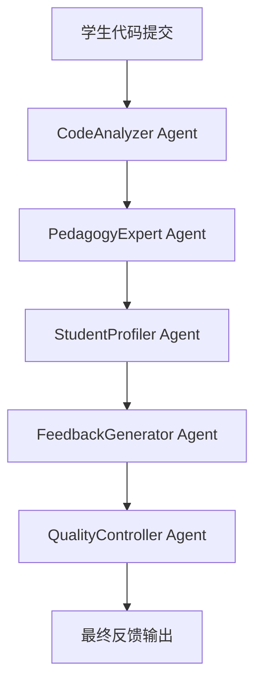
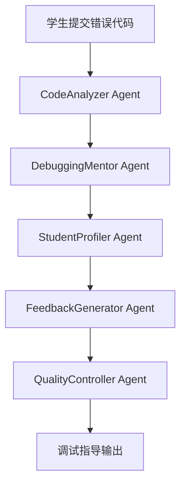
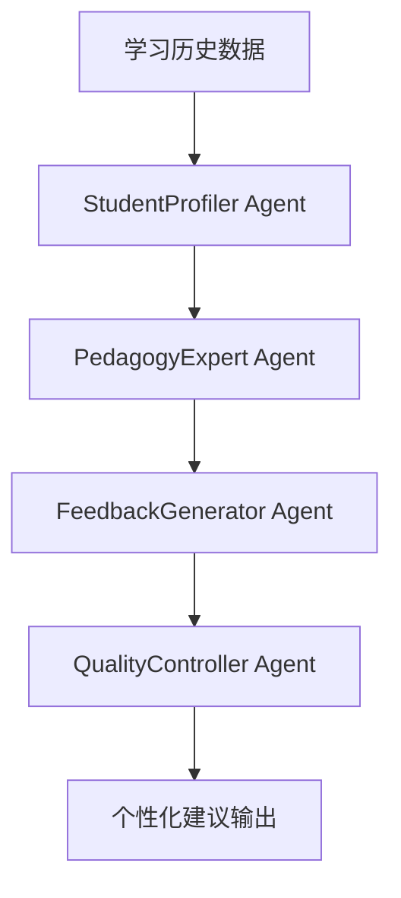

# AutoGen多智能体系统实施指导

**目标读者**: AI Architecture Expert  
**项目**: AI教学助手系统核心引擎  
**版本**: v1.0  
**更新日期**: 2024-01-22

---

## 🎯 系统总体设计

### 核心架构概述
```
AI教学助手多智能体系统架构
├── Agent协调层 (Agent Orchestration Layer)
├── 6个专业AI Agents
├── 通信协议层 (Communication Protocol Layer)
├── 数据流管理层 (Data Flow Management Layer)
└── 外部接口层 (External Interface Layer)
```

### 技术栈选择
- **框架**: AutoGen (推荐最新稳定版本)
- **编程语言**: Python 3.11+
- **LLM模型**: GPT-4o-mini (开发阶段) / 本地模型 (生产备选)
- **消息传递**: AutoGen内置GroupChat机制
- **状态管理**: 基于Agent memory和conversation history
- **接口规范**: RESTful API + JSON格式

---

## 🤖 6个核心AI Agent详细设计

### 1. CodeAnalyzer Agent - 代码分析专家

**职责范围**:
- 语法检查和编译错误检测
- 代码逻辑分析和潜在Bug识别
- 代码风格和规范评估
- 性能和效率问题分析

**输入数据格式**:
```json
{
  "code": "string - 学生提交的代码",
  "language": "string - 编程语言(C/Python)",
  "assignment_type": "string - 作业类型",
  "course_level": "string - 课程难度级别"
}
```

**输出数据格式**:
```json
{
  "syntax_analysis": {
    "has_errors": "boolean",
    "error_list": ["string"],
    "error_severity": "1-5 scale"
  },
  "logic_analysis": {
    "logical_issues": ["string"],
    "complexity_score": "1-10 scale",
    "algorithm_efficiency": "string"
  },
  "style_analysis": {
    "style_score": "1-5 scale",
    "style_suggestions": ["string"]
  },
  "overall_score": "1-100 scale"
}
```

**Agent提示词模板**:
```python
CODEANALYZER_PROMPT = """
你是一位专业的代码分析专家，专门为大学程序设计课程提供代码分析服务。

你的任务：
1. 仔细分析学生提交的{language}代码
2. 从语法、逻辑、风格三个维度进行评估
3. 识别代码中的问题和改进空间
4. 提供准确的分析结果

分析原则：
- 基于{course_level}水平的学生能力进行评估
- 重点关注基础概念的掌握情况
- 提供建设性和教育性的分析
- 避免过于严苛或过于宽松的评判

请始终以JSON格式返回分析结果。
"""
```

### 2. PedagogyExpert Agent - 教学专家

**职责范围**:
- 基于教学理论制定反馈策略
- 分析学习者的认知水平和学习状态
- 提供符合教育原理的指导建议
- 确保反馈的教学有效性

**核心教学理论**:
- **构建主义学习理论**: 基于学生已有知识构建新知识
- **最近发展区理论**: 在学生能力边界上提供恰当挑战
- **支架式教学**: 提供分层次的学习支持
- **反思性学习**: 引导学生思考和自我评估

**输入数据格式**:
```json
{
  "code_analysis": "object - CodeAnalyzer的分析结果",
  "student_level": "string - 学生当前水平",
  "learning_context": "object - 学习背景信息",
  "course_objectives": "array - 课程学习目标"
}
```

**输出数据格式**:
```json
{
  "feedback_strategy": {
    "approach_type": "string - 反馈方法类型",
    "difficulty_adjustment": "string - 难度调整建议",
    "learning_focus": ["string"] - 学习重点
  },
  "pedagogical_recommendations": {
    "next_steps": ["string"],
    "practice_suggestions": ["string"],
    "concept_reinforcement": ["string"]
  },
  "cognitive_scaffolding": {
    "support_level": "1-5 scale",
    "scaffolding_type": "string"
  }
}
```

### 3. StudentProfiler Agent - 学习者画像

**职责范围**:
- 分析学生的学习模式和偏好
- 识别学习强项和薄弱环节
- 提供个性化学习建议
- 跟踪学习进度和发展轨迹

**输入数据格式**:
```json
{
  "student_history": "object - 历史学习数据",
  "current_performance": "object - 当前表现数据",
  "learning_patterns": "object - 学习行为模式",
  "course_progression": "object - 课程进度信息"
}
```

**输出数据格式**:
```json
{
  "learning_profile": {
    "learning_style": "string",
    "strengths": ["string"],
    "weaknesses": ["string"],
    "preferred_pace": "string"
  },
  "personalization_strategy": {
    "content_adaptation": "string",
    "difficulty_preference": "string",
    "feedback_frequency": "string"
  },
  "progress_indicators": {
    "mastery_level": "1-5 scale",
    "improvement_trend": "string",
    "engagement_level": "1-5 scale"
  }
}
```

### 4. FeedbackGenerator Agent - 反馈生成器

**职责范围**:
- 综合各Agent的分析结果
- 生成结构化的教学反馈
- 确保反馈的层次性和渐进性
- 提供具体的改进指导

**反馈结构设计**:
```
教学反馈层次结构
├── 整体评价 (Overall Assessment)
├── 具体问题指出 (Specific Issues)
├── 改进建议 (Improvement Suggestions)
├── 学习资源推荐 (Learning Resources)
└── 下一步行动 (Next Actions)
```

**输入数据格式**:
```json
{
  "code_analysis": "object",
  "pedagogy_strategy": "object", 
  "student_profile": "object",
  "context_info": "object"
}
```

**输出数据格式**:
```json
{
  "structured_feedback": {
    "overall_assessment": "string",
    "strengths_highlighted": ["string"],
    "areas_for_improvement": ["string"],
    "specific_suggestions": ["string"],
    "examples_and_resources": ["string"]
  },
  "feedback_metadata": {
    "feedback_type": "string",
    "difficulty_level": "string", 
    "estimated_reading_time": "string",
    "follow_up_recommended": "boolean"
  }
}
```

### 5. QualityController Agent - 质量控制

**职责范围**:
- 验证反馈内容的准确性和一致性
- 确保反馈符合教学标准
- 检查反馈的可读性和可操作性
- 提供质量评分和改进建议

**质量检查维度**:
```yaml
准确性检查:
  - 技术内容准确性验证
  - 教学建议合理性检查
  - 与学生水平匹配度评估

一致性检查:
  - 多Agent输出一致性验证
  - 反馈风格统一性检查
  - 教学理念一致性确认

可用性检查:
  - 反馈可读性评估
  - 建议可操作性检查
  - 学习资源可访问性验证
```

### 6. DebuggingMentor Agent - 调试导师

**职责范围**:
- 专门处理代码调试和错误排查
- 提供调试思路和方法指导
- 培养学生的问题解决能力
- 引导学生进行系统性思考

**调试指导框架**:
```
调试教学方法论
├── 问题识别 (Problem Identification)
├── 错误定位 (Error Localization)  
├── 原因分析 (Root Cause Analysis)
├── 解决策略 (Solution Strategy)
└── 验证测试 (Validation Testing)
```

---

## 🔄 Agent协作工作流设计

### 工作流1: 作业批改流程


**协作协议**:
```python
ASSIGNMENT_REVIEW_WORKFLOW = {
    "sequence": [
        "CodeAnalyzer",
        "PedagogyExpert", 
        "StudentProfiler",
        "FeedbackGenerator",
        "QualityController"
    ],
    "data_flow": {
        "CodeAnalyzer": {"input": "raw_code", "output": "code_analysis"},
        "PedagogyExpert": {"input": "code_analysis", "output": "pedagogy_strategy"},
        "StudentProfiler": {"input": "code_analysis + student_data", "output": "student_profile"},
        "FeedbackGenerator": {"input": "all_previous_outputs", "output": "structured_feedback"},
        "QualityController": {"input": "structured_feedback", "output": "quality_validated_feedback"}
    },
    "timeout": 30, # 30秒超时
    "retry_policy": "exponential_backoff"
}
```

### 工作流2: 调试辅导流程


### 工作流3: 个性化学习路径


---

## 💻 技术实现框架

### AutoGen基础配置
```python
import autogen
from typing import Dict, List, Any, Optional
import json
import asyncio
from datetime import datetime

# 基础配置
CONFIG_LIST = [
    {
        "model": "gpt-4o-mini",
        "api_key": "your-api-key",
        "base_url": "https://api.openai.com/v1"
    }
]

# LLM配置
LLM_CONFIG = {
    "timeout": 120,
    "cache_seed": 42,
    "config_list": CONFIG_LIST,
    "temperature": 0.1,  # 保持一致性
}
```

### Agent基类设计
```python
class TeachingAgent:
    """教学AI Agent基类"""
    
    def __init__(self, name: str, system_message: str, llm_config: Dict):
        self.name = name
        self.agent = autogen.ConversableAgent(
            name=name,
            system_message=system_message,
            llm_config=llm_config,
            human_input_mode="NEVER",
            max_consecutive_auto_reply=1
        )
        
    def process(self, input_data: Dict[str, Any]) -> Dict[str, Any]:
        """处理输入数据并返回结构化输出"""
        raise NotImplementedError
        
    def validate_output(self, output: Dict[str, Any]) -> bool:
        """验证输出格式和内容"""
        raise NotImplementedError
```

### 核心协调器
```python
class AITeachingSystem:
    """AI教学系统主协调器"""
    
    def __init__(self):
        self.agents = self._initialize_agents()
        self.group_chat = autogen.GroupChat(
            agents=list(self.agents.values()),
            messages=[],
            max_round=20
        )
        self.manager = autogen.GroupChatManager(
            groupchat=self.group_chat,
            llm_config=LLM_CONFIG
        )
        
    def _initialize_agents(self) -> Dict[str, TeachingAgent]:
        """初始化所有AI Agents"""
        agents = {}
        
        # CodeAnalyzer Agent
        agents["CodeAnalyzer"] = CodeAnalyzerAgent()
        
        # PedagogyExpert Agent  
        agents["PedagogyExpert"] = PedagogyExpertAgent()
        
        # StudentProfiler Agent
        agents["StudentProfiler"] = StudentProfilerAgent()
        
        # FeedbackGenerator Agent
        agents["FeedbackGenerator"] = FeedbackGeneratorAgent()
        
        # QualityController Agent
        agents["QualityController"] = QualityControllerAgent()
        
        # DebuggingMentor Agent
        agents["DebuggingMentor"] = DebuggingMentorAgent()
        
        return agents
        
    async def process_assignment(self, assignment_data: Dict) -> Dict:
        """处理作业批改请求"""
        workflow = ASSIGNMENT_REVIEW_WORKFLOW
        return await self._execute_workflow(workflow, assignment_data)
        
    async def process_debugging_help(self, debug_data: Dict) -> Dict:
        """处理调试辅导请求"""  
        workflow = DEBUGGING_HELP_WORKFLOW
        return await self._execute_workflow(workflow, debug_data)
        
    async def _execute_workflow(self, workflow: Dict, input_data: Dict) -> Dict:
        """执行指定的Agent协作工作流"""
        results = {}
        current_data = input_data
        
        for agent_name in workflow["sequence"]:
            agent = self.agents[agent_name]
            try:
                result = await asyncio.wait_for(
                    agent.process(current_data),
                    timeout=workflow.get("timeout", 30)
                )
                results[agent_name] = result
                current_data.update(result)
            except asyncio.TimeoutError:
                # 处理超时情况
                results[agent_name] = {"error": "timeout"}
            except Exception as e:
                # 处理其他异常
                results[agent_name] = {"error": str(e)}
                
        return results
```

---

## 🧪 测试场景和用例

### 测试场景1: C语言基础语法错误
```python
TEST_CASE_1 = {
    "code": """
#include <stdio.h>
int main() {
    int a, b
    printf("Enter two numbers: ");
    scanf("%d %d", &a, &b);
    printf("Sum is: %d", a + b);
    return 0;
}
""",
    "language": "C",
    "assignment_type": "basic_io",
    "course_level": "beginner",
    "expected_issues": ["missing_semicolon"],
    "expected_feedback_type": "syntax_correction"
}
```

### 测试场景2: Python逻辑错误
```python
TEST_CASE_2 = {
    "code": """
def factorial(n):
    if n <= 1:
        return 1
    else:
        return n * factorial(n + 1)  # 逻辑错误：应该是 n - 1

print(factorial(5))
""",
    "language": "Python",
    "assignment_type": "recursion",
    "course_level": "intermediate", 
    "expected_issues": ["infinite_recursion"],
    "expected_feedback_type": "logic_correction"
}
```

### 性能基准测试
```python
PERFORMANCE_BENCHMARKS = {
    "response_time": {
        "target": "< 5 seconds",
        "measurement": "end_to_end_processing_time"
    },
    "accuracy": {
        "target": "> 70%",
        "measurement": "feedback_accuracy_rate"
    },
    "consistency": {
        "target": "> 90%", 
        "measurement": "output_format_consistency"
    },
    "throughput": {
        "target": "> 10 requests/minute",
        "measurement": "concurrent_processing_capacity"
    }
}
```

---

## 🚀 部署和集成指南

### 项目结构
```
ai_teaching_system/
├── agents/
│   ├── __init__.py
│   ├── base_agent.py
│   ├── code_analyzer.py
│   ├── pedagogy_expert.py
│   ├── student_profiler.py
│   ├── feedback_generator.py
│   ├── quality_controller.py
│   └── debugging_mentor.py
├── workflows/
│   ├── __init__.py
│   ├── assignment_review.py
│   ├── debugging_help.py
│   └── personalized_learning.py
├── utils/
│   ├── __init__.py
│   ├── data_validation.py
│   ├── performance_monitor.py
│   └── error_handler.py
├── tests/
│   ├── test_agents.py
│   ├── test_workflows.py
│   └── test_integration.py
├── config/
│   ├── llm_config.py
│   ├── workflow_config.py
│   └── performance_config.py
├── main.py
├── requirements.txt
└── README.md
```

### 依赖安装
```bash
# 创建虚拟环境
python -m venv venv
source venv/bin/activate  # Linux/Mac
# venv\Scripts\activate     # Windows

# 安装依赖
pip install autogen-agentchat>=0.2.0
pip install openai>=1.0.0
pip install fastapi>=0.100.0
pip install uvicorn>=0.20.0
pip install pydantic>=2.0.0
pip install asyncio
pip install pytest>=7.0.0
```

### API接口设计
```python
from fastapi import FastAPI, HTTPException
from pydantic import BaseModel

app = FastAPI(title="AI Teaching Assistant API")

class AssignmentRequest(BaseModel):
    code: str
    language: str
    assignment_type: str
    course_level: str
    student_id: Optional[str] = None

class TeachingResponse(BaseModel):
    feedback: Dict[str, Any]
    processing_time: float
    quality_score: float

@app.post("/api/v1/review-assignment", response_model=TeachingResponse)
async def review_assignment(request: AssignmentRequest):
    """处理作业批改请求"""
    try:
        system = AITeachingSystem()
        result = await system.process_assignment(request.dict())
        return TeachingResponse(**result)
    except Exception as e:
        raise HTTPException(status_code=500, detail=str(e))
```

---

## 📊 监控和优化

### 关键指标监控
```python
class PerformanceMonitor:
    def __init__(self):
        self.metrics = {
            "response_time": [],
            "accuracy_rate": [],
            "error_rate": [],
            "throughput": []
        }
    
    def record_performance(self, metric_name: str, value: float):
        """记录性能指标"""
        self.metrics[metric_name].append({
            "timestamp": datetime.now(),
            "value": value
        })
    
    def get_performance_summary(self) -> Dict:
        """获取性能摘要报告"""
        summary = {}
        for metric_name, values in self.metrics.items():
            if values:
                recent_values = [v["value"] for v in values[-100:]]
                summary[metric_name] = {
                    "avg": sum(recent_values) / len(recent_values),
                    "max": max(recent_values),
                    "min": min(recent_values)
                }
        return summary
```

### 优化建议
1. **缓存策略**: 对相似代码的分析结果进行缓存
2. **并行处理**: 部分Agent可以并行执行以提高效率
3. **模型优化**: 根据实际使用情况调整模型参数
4. **错误处理**: 建立完善的降级和重试机制

---

## 🎯 交付标准和验收要求

### 必须交付 (Must Have)
- ✅ 完整的6个AI Agent实现
- ✅ 至少2个完整工作流演示 
- ✅ 基础API接口和文档
- ✅ 单元测试和集成测试
- ✅ 性能基准测试结果

### 期望交付 (Should Have)
- ✅ 响应时间 < 5秒
- ✅ 反馈准确率 > 70%
- ✅ 完整的错误处理机制
- ✅ 监控和日志系统

### 可选交付 (Nice to Have)
- ✅ 分布式部署支持
- ✅ 多语言模型支持
- ✅ 高级优化和缓存策略

**作为AI Architecture Expert，请基于这份详细指南，开发出高质量的AutoGen多智能体教学系统。确保系统既具备技术先进性，又满足实际教学场景的需求。**