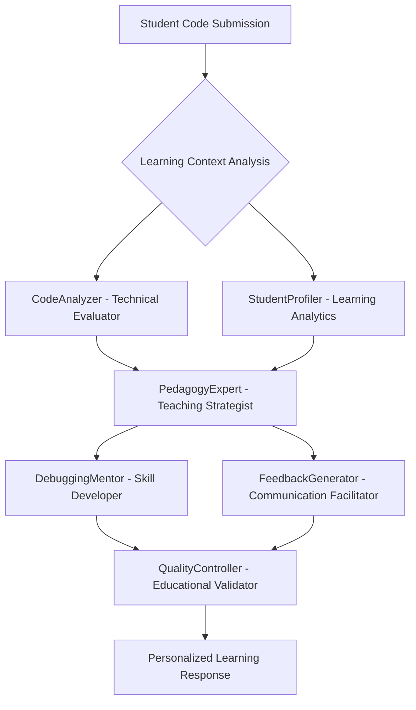

# AI Agent与课程内容精确映射关系

## 🎯 映射设计概述

### 教育理论基础
本映射基于布鲁姆教育目标分类学(Bloom's Taxonomy)、维果茨基最近发展区理论(ZPD)和建构主义学习理论，将6个专业AI Agent的功能与C语言和Python课程的具体教学内容进行精确对应，确保每个知识点都有相应的AI支持策略。

### 核心设计原则
1. **认知负荷优化**：根据认知负荷理论，为不同复杂度的知识点配置相应强度的AI支持
2. **脚手架式学习**：提供逐步递减的支持，促进学生独立学习能力发展
3. **多元智能支持**：针对不同学习风格提供差异化的教学策略
4. **形成性评估**：实时监测学习进程，动态调整教学策略

---

## 🔄 AI Agent协作映射框架

### Agent间的教育角色定义



---

## 📚 C语言课程精确映射

### 模块1：C语言基础与环境搭建
**学习目标层级**：记忆 → 理解 → 应用

#### CodeAnalyzer映射配置
```yaml
分析重点:
  语法基础检查:
    - 分号缺失检测 (错误严重度: 高)
    - 括号匹配验证 (错误严重度: 高)
    - 预处理指令正确性 (错误严重度: 中)
    - main函数结构规范 (错误严重度: 中)
  
  编码规范评估:
    - 命名规范检查 (教育重点: 养成良好习惯)
    - 缩进格式验证 (教育重点: 代码可读性)
    - 注释质量评估 (教育重点: 文档化意识)
    
  基础结构分析:
    - 程序流程逻辑 (教育重点: 结构化思维)
    - 头文件包含正确性 (教育重点: 模块化概念)
```

#### PedagogyExpert映射配置
```yaml
教学策略:
  初学者支持 (适用前2周):
    主策略: ENCOURAGE
    辅策略: EXPLAIN
    重点: 
      - 概念澄清和基础建立
      - 错误恐惧消除
      - 成功体验积累
  
  反馈风格:
    语调: 温和鼓励
    详细程度: 详细说明 + 具体示例
    频率: 高频互动
```

#### StudentProfiler映射配置
```yaml
学习特征跟踪:
  认知维度:
    - 语法掌握速度 (快速/中等/缓慢)
    - 概念理解深度 (表层/中层/深层)
    - 错误模式识别 (语法型/逻辑型/概念型)
  
  行为维度:
    - 练习完成率 (>90%/70-90%/<70%)
    - 主动求助频率 (高/中/低)
    - 代码调试尝试次数 (自主/需要引导/依赖)
  
  情感维度:
    - 学习信心水平 (1-10分)
    - 挫折承受度 (高/中/低)
    - 编程兴趣强度 (强/中/弱)
```

### 模块2：数据类型与运算
**学习目标层级**：理解 → 应用 → 分析

#### CodeAnalyzer映射配置
```yaml
分析重点:
  数据类型使用:
    - 类型选择合理性 (教育重点: 数据表示概念)
    - 变量初始化检查 (安全编程意识)
    - 类型转换安全性 (精度损失预防)
    - 溢出风险评估 (边界情况思考)
  
  运算符使用:
    - 优先级错误识别 (逻辑思维训练)
    - 自增自减使用规范 (副作用理解)
    - 位运算正确性 (底层原理掌握)
    
  性能影响分析:
    - 不必要的类型转换
    - 重复计算优化建议
    - 内存使用效率评估
```

#### DebuggingMentor映射配置
```yaml
调试技能培养:
  问题诊断技能:
    - 类型不匹配问题识别
    - 运算溢出问题定位
    - 精度损失问题分析
  
  调试策略教学:
    - 打印调试方法 (printf debugging)
    - 断点设置技巧
    - 变量监视方法
  
  预防性思维培养:
    - 输入验证习惯
    - 边界条件检查
    - 异常情况预期
```

### 模块3：程序控制结构
**学习目标层级**：应用 → 分析 → 综合

#### CodeAnalyzer映射配置
```yaml
分析重点:
  条件结构:
    - 条件表达式正确性 (布尔逻辑掌握)
    - 分支覆盖完整性 (逻辑完备性)
    - 嵌套深度合理性 (代码复杂度管理)
    - 边界条件处理 (鲁棒性思考)
  
  循环结构:
    - 循环终止条件 (算法正确性)
    - 循环变量管理 (状态控制)
    - 死循环风险检测 (安全编程)
    - 循环效率分析 (算法复杂度意识)
```

#### PedagogyExpert映射配置
```yaml
教学策略:
  进阶学习者支持:
    主策略: HINT
    辅策略: REFINE
    重点:
      - 算法思维培养
      - 问题分解能力
      - 代码优化意识
  
  思维引导方法:
    - 伪代码设计引导
    - 流程图思考方法
    - 测试用例设计思维
```

### 模块4：函数设计与应用
**学习目标层级**：分析 → 综合 → 评估

#### CodeAnalyzer映射配置
```yaml
分析重点:
  函数设计质量:
    - 函数职责单一性 (模块化原则)
    - 参数设计合理性 (接口设计)
    - 返回值处理完整性 (错误处理)
    - 函数命名规范性 (可读性)
  
  模块化程度:
    - 代码重用性评估
    - 函数依赖关系分析
    - 全局变量使用合理性
    - 作用域管理正确性
```

### 模块5：数组与字符串
**学习目标层级**：应用 → 分析 → 综合

#### CodeAnalyzer映射配置
```yaml
分析重点:
  内存安全:
    - 数组越界检测 (安全编程核心)
    - 缓冲区溢出预防 (安全意识)
    - 内存访问模式分析 (性能优化)
  
  算法效率:
    - 数组遍历优化 (循环优化)
    - 字符串操作效率 (库函数使用)
    - 排序算法选择 (算法复杂度)
```

#### DebuggingMentor映射配置
```yaml
调试技能升级:
  内存调试技能:
    - 数组越界调试方法
    - 内存访问模式分析
    - 字符串处理调试技巧
  
  算法调试策略:
    - 循环不变式验证
    - 边界条件测试
    - 性能瓶颈识别
```

### 模块6：指针与内存管理
**学习目标层级**：分析 → 综合 → 评估

#### CodeAnalyzer映射配置
```yaml
分析重点:
  内存安全 (关键重点):
    - 空指针访问检测 (严重错误预防)
    - 野指针识别 (内存安全)
    - 内存泄漏风险评估 (资源管理)
    - 双重释放检测 (程序稳定性)
  
  指针使用规范:
    - 指针运算正确性 (底层理解)
    - 指针与数组关系 (概念掌握)
    - 函数指针使用 (高级特性)
```

#### PedagogyExpert映射配置
```yaml
教学策略:
  高级概念支持:
    主策略: CHALLENGE
    辅策略: REFINE
    重点:
      - 内存模型理解
      - 系统级思维培养
      - 性能优化意识
  
  概念建构方法:
    - 内存图示化教学
    - 指针操作可视化
    - 内存布局分析
```

### 模块7：结构体与数据组织
**学习目标层级**：综合 → 评估 → 创造

#### CodeAnalyzer映射配置
```yaml
分析重点:
  数据结构设计:
    - 结构体设计合理性 (抽象能力)
    - 内存对齐优化 (底层优化)
    - 数据封装程度 (模块化思维)
  
  复杂数据处理:
    - 嵌套结构处理 (层次化思维)
    - 结构体数组管理 (批量数据处理)
    - 链表操作正确性 (动态数据结构)
```

---

## 🐍 Python课程精确映射

### 模块1：Python入门与开发环境
**学习目标层级**：记忆 → 理解 → 应用

#### CodeAnalyzer映射配置
```yaml
分析重点:
  Python风格检查:
    - PEP8规范遵循度 (Python文化)
    - 命名约定正确性 (snake_case等)
    - 导入语句规范性 (模块化思维)
  
  语法特性使用:
    - 缩进一致性检查 (Python核心特征)
    - 字符串格式化方式 (现代Python特性)
    - 变量作用域理解 (作用域规则)
```

#### PedagogyExpert映射配置
```yaml
教学策略:
  语言转换支持 (针对有C语言基础):
    主策略: COMPARE
    辅策略: ENCOURAGE
    重点:
      - 语法差异对比
      - 思维模式转换
      - Python优势强调
  
  零基础支持:
    主策略: ENCOURAGE
    辅策略: EXPLAIN
    重点:
      - 编程思维建立
      - 交互式学习体验
      - 即时反馈机制
```

### 模块2：数据类型与基本操作
**学习目标层级**：理解 → 应用 → 分析

#### CodeAnalyzer映射配置
```yaml
分析重点:
  数据类型使用:
    - 动态类型理解 (Python特性)
    - 可变/不可变类型区分 (内存模型)
    - 类型提示使用 (现代Python实践)
  
  操作效率分析:
    - 字符串操作优化 (join vs 拼接)
    - 数值运算精度 (浮点数陷阱)
    - 内存使用模式 (对象引用)
```

### 模块3：控制流程与异常处理
**学习目标层级**：应用 → 分析 → 综合

#### CodeAnalyzer映射配置
```yaml
分析重点:
  控制结构优化:
    - 条件表达式简化 (Pythonic写法)
    - 循环结构选择 (for vs while适用场景)
    - 列表推导式使用 (函数式编程思维)
  
  异常处理质量:
    - 异常类型选择 (精确异常处理)
    - try-except结构合理性 (错误边界)
    - 资源清理完整性 (with语句使用)
```

#### DebuggingMentor映射配置
```yaml
调试技能培养:
  Python特有调试:
    - 异常追踪阅读 (traceback解读)
    - 调试器使用 (pdb基础)
    - 日志记录方法 (logging模块)
  
  问题定位策略:
    - 类型错误诊断 (TypeError分析)
    - 逻辑错误识别 (断言使用)
    - 性能问题定位 (profiling基础)
```

### 模块4：数据结构与算法基础
**学习目标层级**：分析 → 综合 → 评估

#### CodeAnalyzer映射配置
```yaml
分析重点:
  数据结构选择:
    - 列表vs元组使用场景 (可变性考量)
    - 字典vs集合应用 (查找效率)
    - 数据结构嵌套合理性 (复杂度管理)
  
  算法实现质量:
    - 时间复杂度分析 (效率意识)
    - 空间复杂度评估 (内存使用)
    - Pythonic实现方式 (语言特性利用)
```

#### PedagogyExpert映射配置
```yaml
教学策略:
  算法思维培养:
    主策略: HINT
    辅策略: CHALLENGE
    重点:
      - 抽象思维训练
      - 问题分解方法
      - 效率分析意识
  
  Python特色强调:
    - 内置函数利用 (sorted, enumerate等)
    - 生成器概念 (内存效率)
    - 函数式编程元素 (map, filter等)
```

### 模块5：函数与模块设计
**学习目标层级**：综合 → 评估 → 创造

#### CodeAnalyzer映射配置
```yaml
分析重点:
  函数设计质量:
    - 参数设计灵活性 (*args, **kwargs)
    - 默认参数使用合理性 (可变对象陷阱)
    - 函数文档字符串 (docstring规范)
  
  模块化程度:
    - 模块组织结构 (包和模块设计)
    - 导入方式规范性 (避免循环导入)
    - 命名空间管理 (全局变量控制)
```

### 模块6：面向对象编程
**学习目标层级**：分析 → 综合 → 评估

#### CodeAnalyzer映射配置
```yaml
分析重点:
  OOP设计质量:
    - 类设计单一职责 (SOLID原则)
    - 继承层次合理性 (is-a关系)
    - 方法设计内聚性 (功能聚合)
  
  Python OOP特性:
    - 特殊方法使用 (__init__, __str__等)
    - 属性访问控制 (私有属性约定)
    - 多重继承处理 (MRO理解)
```

### 模块7：数据处理与文件操作
**学习目标层级**：应用 → 分析 → 创造

#### CodeAnalyzer映射配置
```yaml
分析重点:
  文件处理质量:
    - 文件操作安全性 (异常处理)
    - 资源管理完整性 (with语句)
    - 编码处理正确性 (Unicode处理)
  
  数据处理效率:
    - CSV处理最佳实践 (csv模块使用)
    - JSON数据处理 (序列化/反序列化)
    - 大文件处理策略 (生成器使用)
```

---

## 🔄 跨Agent协作教学场景

### 场景1：语法错误处理协作
```yaml
触发条件: 学生代码存在语法错误
协作流程:
  1. CodeAnalyzer: 
     - 识别具体语法错误类型
     - 分析错误严重程度和影响范围
     - 提供错误定位信息
  
  2. StudentProfiler: 
     - 记录错误类型和频率
     - 分析学生错误模式
     - 更新学习困难点标记
  
  3. PedagogyExpert: 
     - 根据学生水平选择解释深度
     - 制定个性化教学策略
     - 决定是否需要补充基础概念
  
  4. FeedbackGenerator: 
     - 生成温和的错误提示
     - 提供具体的修改建议
     - 包含鼓励性语言
  
  5. QualityController: 
     - 验证反馈的教育适当性
     - 确保不会打击学生积极性
     - 检查解释的准确性
```

### 场景2：算法优化指导协作
```yaml
触发条件: 代码功能正确但效率较低
协作流程:
  1. CodeAnalyzer: 
     - 分析算法时间/空间复杂度
     - 识别性能瓶颈位置
     - 提供优化建议方向
  
  2. PedagogyExpert: 
     - 评估学生当前算法理解水平
     - 选择合适的优化教学深度
     - 制定渐进式改进计划
  
  3. DebuggingMentor: 
     - 提供性能分析工具使用指导
     - 教授profiling方法
     - 引导性能测试思维
  
  4. FeedbackGenerator: 
     - 先肯定代码正确性
     - 逐步引导优化思考
     - 提供对比示例
```

### 场景3：概念理解困难协作
```yaml
触发条件: 学生多次在同类问题上出错
协作流程:
  1. StudentProfiler: 
     - 识别重复错误模式
     - 分析概念理解程度
     - 评估学习策略适合度
  
  2. PedagogyExpert: 
     - 诊断概念理解障碍
     - 选择替代解释方法
     - 设计概念强化练习
  
  3. FeedbackGenerator: 
     - 重新解释核心概念
     - 提供多角度理解方法
     - 设计渐进式练习序列
  
  4. QualityController: 
     - 验证概念解释准确性
     - 确保教学方法适当性
     - 评估练习难度匹配度
```

---

## 📊 映射效果评估框架

### 教学效果指标
```yaml
认知层面:
  知识掌握度:
    - 概念理解准确率 (>90%为优秀)
    - 语法应用正确率 (>85%为良好)
    - 问题解决成功率 (>80%为达标)
  
  技能发展度:
    - 代码调试能力提升
    - 算法设计能力增长
    - 代码质量改进程度

情感层面:
  学习动机:
    - 编程兴趣维持度
    - 挑战接受意愿
    - 自主学习频率
  
  学习信心:
    - 错误恐惧程度降低
    - 独立解决问题意愿增强
    - 学习成就感提升

行为层面:
  学习行为:
    - 练习完成质量
    - 主动求助适当性
    - 同伴互助参与度
```

### 映射精度评估
```yaml
Agent响应精度:
  技术分析准确率: >95%
  教学策略适当性: >90%
  反馈个性化程度: >85%
  质量控制有效性: >92%

课程覆盖完整性:
  知识点覆盖率: 100%
  技能点映射率: >95%
  学习目标对齐度: >90%
```

这个精确映射框架确保每个AI Agent都能在适当的教学情境中发挥专业作用，为学生提供个性化、系统性和高质量的编程学习支持。