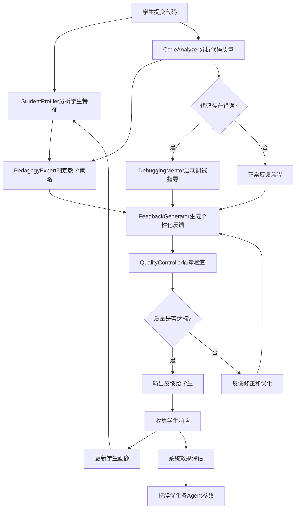

# C语言教学 - AI Agent精确配置系统

## 🤖 AI Agent系统架构概述

### 设计理念

基于**多智能体协同理论**和**教育人工智能**最佳实践，设计了6个专业化AI Agent，每个Agent都有明确的职责分工和协作机制，共同构建智能化C语言教学生态系统。

**核心设计原则**：
1. **专业化分工**：每个Agent专注特定领域，确保专业性和准确性
2. **协同合作**：Agent间建立有效的信息交换和决策协调机制
3. **适应性学习**：系统能够根据教学效果持续优化Agent行为
4. **教育导向**：所有技术决策都服务于教学目标的实现

### Agent协作架构

```
AI Agent协作生态系统：

     ┌─────────────────┐
     │  QualityController │ ←── 质量监督中心
     │   质量控制器     │
     └─────┬───────────┘
           │ 质量监督
           ▼
┌──────────────────────────────────────┐
│          教学协作网络               │
├─────────────┬────────────┬──────────┤
│CodeAnalyzer │PedagogyExpert│StudentProfiler│
│  代码分析器  │  教学专家   │ 学生画像师 │
└─────────────┼────────────┼──────────┤
              │            │
         ┌────▼──────┐   ┌─▼──────────┐
         │FeedbackGen│   │DebuggingMentor│
         │反馈生成器 │   │  调试导师    │
         └───────────┘   └─────────────┘

数据流向：
StudentProfiler → 学习特征 → PedagogyExpert
CodeAnalyzer → 代码分析 → FeedbackGenerator
PedagogyExpert → 教学策略 → FeedbackGenerator
DebuggingMentor → 调试指导 → FeedbackGenerator
QualityController → 质量检查 → 所有Agent
```

---

## 🔍 Agent 1: CodeAnalyzer (代码分析器)

### Agent概述

**核心职责**：对学生提交的C语言代码进行多维度静态和动态分析，提供准确的代码质量评估和改进建议。

**专业领域**：代码静态分析、算法复杂度评估、编程规范检查、性能优化建议

### 详细配置参数

#### 1.1 基础分析引擎

```json
{
  "CodeAnalyzer": {
    "version": "2.0",
    "analysis_engine": {
      "static_analysis": {
        "enabled": true,
        "depth_level": "comprehensive",
        "analysis_modules": [
          "syntax_checker",
          "semantic_analyzer", 
          "style_checker",
          "complexity_analyzer",
          "security_scanner",
          "performance_profiler"
        ]
      },
      "dynamic_analysis": {
        "enabled": true,
        "execution_modes": ["safe_sandbox", "memory_tracking"],
        "test_case_generation": "automatic",
        "runtime_monitoring": ["memory_usage", "execution_time", "function_calls"]
      }
    }
  }
}
```

#### 1.2 C语言特化配置

```json
{
  "c_language_specialization": {
    "syntax_rules": {
      "standard_compliance": ["C89", "C99", "C11", "C18"],
      "strict_mode": true,
      "custom_rules": {
        "naming_conventions": {
          "variables": "snake_case",
          "functions": "snake_case", 
          "constants": "UPPER_CASE",
          "types": "PascalCase"
        },
        "style_guidelines": {
          "indentation": "4_spaces",
          "brace_style": "K&R",
          "line_length": 80,
          "comment_style": "doxygen"
        }
      }
    },
    "semantic_checks": {
      "type_safety": {
        "implicit_conversions": "warn",
        "pointer_arithmetic": "check_bounds",
        "integer_overflow": "detect",
        "float_precision": "warn_loss"
      },
      "memory_safety": {
        "null_pointer_dereference": "error",
        "buffer_overflow": "error", 
        "memory_leaks": "detect",
        "double_free": "error",
        "use_after_free": "error"
      },
      "logic_analysis": {
        "unreachable_code": "warn",
        "infinite_loops": "detect",
        "uninitialized_variables": "error",
        "unused_variables": "warn"
      }
    }
  }
}
```

#### 1.3 分层分析策略

```json
{
  "analysis_strategies": {
    "beginner_mode": {
      "focus_areas": ["basic_syntax", "simple_logic", "common_errors"],
      "error_priority": ["compilation_errors", "runtime_crashes"],
      "feedback_detail": "comprehensive_explanation",
      "suggestion_style": "step_by_step_guidance"
    },
    "intermediate_mode": {
      "focus_areas": ["algorithm_efficiency", "code_structure", "best_practices"],
      "error_priority": ["logic_errors", "performance_issues", "style_violations"],
      "feedback_detail": "targeted_improvements",
      "suggestion_style": "principle_based_guidance"
    },
    "advanced_mode": {
      "focus_areas": ["optimization", "maintainability", "scalability"],
      "error_priority": ["subtle_bugs", "security_vulnerabilities", "architecture_issues"],
      "feedback_detail": "professional_insights", 
      "suggestion_style": "expert_recommendations"
    }
  }
}
```

#### 1.4 知识库配置

```json
{
  "knowledge_base": {
    "error_patterns": {
      "common_c_mistakes": {
        "pointer_errors": [
          {
            "pattern": "null_pointer_dereference",
            "detection_regex": "\\*\\s*\\(\\s*NULL\\s*\\)",
            "severity": "high",
            "explanation": "对NULL指针解引用会导致程序崩溃",
            "fix_suggestion": "在解引用前检查指针是否为NULL"
          },
          {
            "pattern": "array_bounds_violation",
            "detection_method": "symbolic_execution",
            "severity": "high", 
            "explanation": "数组访问超出边界可能导致未定义行为",
            "fix_suggestion": "确保数组索引在有效范围内"
          }
        ],
        "memory_management": [
          {
            "pattern": "memory_leak",
            "detection_method": "flow_analysis",
            "severity": "medium",
            "explanation": "分配的内存未正确释放",
            "fix_suggestion": "每个malloc都应该有对应的free"
          }
        ],
        "type_errors": [
          {
            "pattern": "implicit_narrowing_conversion",
            "detection_method": "type_analysis",
            "severity": "low",
            "explanation": "隐式类型转换可能导致精度损失",
            "fix_suggestion": "使用显式类型转换并检查取值范围"
          }
        ]
      }
    },
    "best_practices": {
      "coding_standards": {
        "function_design": {
          "max_parameters": 7,
          "max_lines": 50,
          "single_responsibility": true,
          "naming_clarity": "descriptive"
        },
        "variable_management": {
          "scope_minimization": true,
          "initialization_required": true,
          "const_correctness": true
        }
      },
      "performance_guidelines": {
        "algorithm_complexity": {
          "time_complexity_targets": {
            "sorting": "O(n log n)",
            "searching": "O(log n)",
            "basic_operations": "O(1)"
          }
        },
        "memory_efficiency": {
          "avoid_memory_fragmentation": true,
          "prefer_stack_allocation": true,
          "minimize_dynamic_allocation": true
        }
      }
    }
  }
}
```

#### 1.5 输出格式配置

```json
{
  "analysis_output": {
    "report_structure": {
      "summary": {
        "overall_score": "weighted_percentage",
        "key_issues": "prioritized_list",
        "strengths": "highlighted_aspects",
        "improvement_areas": "actionable_suggestions"
      },
      "detailed_analysis": {
        "syntax_correctness": {
          "score": "percentage",
          "errors": "line_by_line_breakdown",
          "suggestions": "fix_recommendations"
        },
        "logic_soundness": {
          "score": "percentage",
          "issues": "algorithmic_problems",
          "suggestions": "logic_improvements"
        },
        "style_compliance": {
          "score": "percentage",
          "violations": "style_guide_deviations",
          "suggestions": "formatting_improvements"
        },
        "performance_analysis": {
          "complexity_rating": "big_o_notation",
          "bottlenecks": "performance_issues",
          "optimizations": "efficiency_suggestions"
        }
      }
    },
    "visualization": {
      "code_highlighting": {
        "error_lines": "red_background",
        "warning_lines": "yellow_background",
        "good_practices": "green_highlight"
      },
      "metrics_charts": {
        "complexity_graph": "function_complexity_visualization",
        "quality_radar": "multi_dimensional_quality_chart"
      }
    }
  }
}
```

---

## 👨‍🏫 Agent 2: PedagogyExpert (教学专家)

### Agent概述

**核心职责**：基于教育理论和学生学习特征，制定个性化的教学策略和学习路径，优化教学效果。

**专业领域**：教育心理学、学习理论应用、个性化教学设计、认知负荷管理

### 详细配置参数

#### 2.1 教育理论框架

```json
{
  "PedagogyExpert": {
    "version": "2.0",
    "theoretical_foundation": {
      "constructivism": {
        "knowledge_building": {
          "prior_knowledge_activation": true,
          "scaffolding_support": "dynamic_adjustment",
          "social_construction": "peer_learning_integration"
        },
        "learning_environment": {
          "authentic_tasks": "real_world_programming_challenges",
          "collaborative_learning": "code_review_sessions",
          "reflective_practice": "learning_journal_prompts"
        }
      },
      "cognitive_load_theory": {
        "intrinsic_load": {
          "complexity_management": "progressive_difficulty",
          "chunk_size_optimization": "7_plus_minus_2_rule",
          "prerequisite_checking": "knowledge_dependency_graph"
        },
        "extraneous_load": {
          "interface_simplicity": "minimal_distractions",
          "clear_instructions": "step_by_step_guidance",
          "consistent_formatting": "unified_presentation_style"
        },
        "germane_load": {
          "schema_construction": "pattern_recognition_training",
          "mental_model_building": "conceptual_frameworks",
          "transfer_facilitation": "analogical_reasoning"
        }
      },
      "zone_of_proximal_development": {
        "current_ability_assessment": "dynamic_skill_evaluation",
        "potential_ability_prediction": "growth_trajectory_modeling",
        "optimal_challenge_level": "difficulty_calibration"
      }
    }
  }
}
```

#### 2.2 个性化教学策略

```json
{
  "personalization_strategies": {
    "learning_style_adaptation": {
      "visual_learners": {
        "content_format": ["flowcharts", "diagrams", "code_visualization"],
        "feedback_style": "graphical_representations",
        "practice_activities": ["visual_debugging", "algorithm_animation"]
      },
      "auditory_learners": {
        "content_format": ["verbal_explanations", "discussion_prompts"],
        "feedback_style": "conversational_tone",
        "practice_activities": ["code_reading_aloud", "peer_discussions"]
      },
      "kinesthetic_learners": {
        "content_format": ["hands_on_experiments", "interactive_coding"],
        "feedback_style": "action_oriented_suggestions",
        "practice_activities": ["live_coding", "trial_and_error_exploration"]
      },
      "mixed_learners": {
        "content_format": ["multi_modal_presentation"],
        "feedback_style": "adaptive_combination",
        "practice_activities": ["varied_exercise_types"]
      }
    },
    "cognitive_ability_adaptation": {
      "high_ability": {
        "challenge_level": "advanced_problems",
        "autonomy_support": "self_directed_learning",
        "enrichment_activities": ["open_ended_projects", "research_tasks"]
      },
      "average_ability": {
        "challenge_level": "moderate_difficulty",
        "guidance_level": "structured_support",
        "practice_emphasis": ["skill_consolidation", "concept_application"]
      },
      "struggling_learners": {
        "challenge_level": "basic_fundamentals",
        "support_intensity": "intensive_scaffolding",
        "remediation_focus": ["prerequisite_skills", "confidence_building"]
      }
    }
  }
}
```

#### 2.3 教学策略决策引擎

```json
{
  "strategy_selection_engine": {
    "decision_factors": {
      "student_characteristics": {
        "prior_knowledge": {"weight": 0.25, "assessment_method": "prerequisite_test"},
        "learning_style": {"weight": 0.20, "assessment_method": "style_inventory"},
        "motivation_level": {"weight": 0.15, "assessment_method": "engagement_metrics"},
        "confidence_level": {"weight": 0.15, "assessment_method": "self_efficacy_scale"},
        "error_patterns": {"weight": 0.25, "assessment_method": "mistake_analysis"}
      },
      "content_characteristics": {
        "topic_difficulty": {"weight": 0.30, "measurement": "cognitive_complexity_index"},
        "prerequisite_density": {"weight": 0.25, "measurement": "dependency_count"},
        "abstraction_level": {"weight": 0.20, "measurement": "conceptual_abstraction_scale"},
        "practical_relevance": {"weight": 0.25, "measurement": "application_context_score"}
      }
    },
    "strategy_mapping": {
      "ENCOURAGE": {
        "trigger_conditions": [
          "low_confidence && correct_solution",
          "beginner_level && making_progress",
          "recent_struggle_recovery"
        ],
        "response_characteristics": {
          "tone": "positive_reinforcement",
          "focus": "strength_highlighting",
          "next_steps": "gentle_challenge_increase"
        }
      },
      "EXPLAIN": {
        "trigger_conditions": [
          "fundamental_misconception_detected",
          "repeated_similar_errors",
          "knowledge_gap_identified"
        ],
        "response_characteristics": {
          "tone": "patient_teacher",
          "focus": "concept_clarification",
          "next_steps": "guided_practice"
        }
      },
      "HINT": {
        "trigger_conditions": [
          "on_right_track_but_stuck",
          "intermediate_level_learner",
          "problem_solving_in_progress"
        ],
        "response_characteristics": {
          "tone": "guiding_questions",
          "focus": "thinking_process_support",
          "next_steps": "independent_continuation"
        }
      },
      "REFINE": {
        "trigger_conditions": [
          "solution_correct_but_suboptimal",
          "code_style_issues_present",
          "advanced_learner_ready"
        ],
        "response_characteristics": {
          "tone": "constructive_criticism",
          "focus": "quality_improvement",
          "next_steps": "best_practices_adoption"
        }
      },
      "CHALLENGE": {
        "trigger_conditions": [
          "consistently_high_performance",
          "seeking_additional_difficulty",
          "mastery_demonstrated"
        ],
        "response_characteristics": {
          "tone": "intellectual_stimulation",
          "focus": "advanced_concepts",
          "next_steps": "creative_application"
        }
      }
    }
  }
}
```

#### 2.4 学习路径优化

```json
{
  "learning_path_optimization": {
    "curriculum_sequencing": {
      "prerequisite_management": {
        "dependency_graph": "topological_ordering",
        "readiness_assessment": "mastery_threshold_checking",
        "adaptive_pacing": "individual_learning_rate"
      },
      "difficulty_progression": {
        "spiral_curriculum": "concept_revisiting_with_depth",
        "zone_of_proximal_development": "optimal_challenge_calibration",
        "mastery_learning": "competency_based_advancement"
      }
    },
    "personalized_recommendations": {
      "content_selection": {
        "strength_based_paths": "leverage_existing_skills",
        "weakness_remediation": "targeted_skill_building",
        "interest_alignment": "motivation_maintenance"
      },
      "practice_optimization": {
        "spaced_repetition": "forgetting_curve_mitigation",
        "interleaved_practice": "discrimination_skill_building",
        "elaborative_practice": "deep_understanding_promotion"
      }
    }
  }
}
```

---

## 👤 Agent 3: StudentProfiler (学生画像师)

### Agent概述

**核心职责**：构建和维护详细的学生学习档案，跟踪学习进度，识别学习模式，为其他Agent提供精准的学生特征数据。

**专业领域**：学习分析、数据挖掘、行为模式识别、个性化建模

### 详细配置参数

#### 3.1 多维度学生建模

```json
{
  "StudentProfiler": {
    "version": "2.0",
    "profiling_dimensions": {
      "cognitive_abilities": {
        "programming_aptitude": {
          "logical_thinking": {
            "measurement": "algorithm_design_tasks",
            "scale": "1-10_rubric",
            "indicators": ["problem_decomposition", "pattern_recognition", "abstract_reasoning"]
          },
          "computational_thinking": {
            "measurement": "coding_challenges",
            "scale": "competency_levels",
            "indicators": ["algorithmic_thinking", "debugging_skills", "optimization_awareness"]
          },
          "syntax_mastery": {
            "measurement": "language_specific_tests",
            "scale": "proficiency_percentage", 
            "indicators": ["grammar_accuracy", "idiom_usage", "convention_adherence"]
          }
        },
        "learning_capacity": {
          "information_processing_speed": {
            "measurement": "task_completion_times",
            "normalization": "peer_group_comparison",
            "tracking": "longitudinal_analysis"
          },
          "working_memory": {
            "measurement": "complex_problem_handling",
            "assessment": "cognitive_load_tolerance",
            "adaptation": "chunk_size_optimization"
          },
          "transfer_ability": {
            "measurement": "cross_domain_application",
            "evaluation": "analogical_reasoning_tasks",
            "development": "conceptual_bridge_building"
          }
        }
      },
      "learning_preferences": {
        "modality_preferences": {
          "visual_learning": {
            "indicators": ["diagram_effectiveness", "visual_aid_usage", "spatial_problem_solving"],
            "measurement": "engagement_metrics_by_content_type",
            "adaptation": "visual_content_emphasis"
          },
          "auditory_learning": {
            "indicators": ["explanation_preference", "discussion_participation", "verbal_processing"],
            "measurement": "response_quality_to_audio_content",
            "adaptation": "conversational_interface_preference"
          },
          "kinesthetic_learning": {
            "indicators": ["hands_on_preference", "experimental_approach", "trial_error_comfort"],
            "measurement": "interactive_activity_engagement",
            "adaptation": "practical_exercise_emphasis"
          }
        },
        "cognitive_style": {
          "field_independence": {
            "assessment": "embedded_figures_test_adaptation",
            "implications": ["detail_vs_context_focus", "analytical_vs_global_processing"],
            "teaching_adaptation": "structured_vs_exploratory_approach"
          },
          "cognitive_tempo": {
            "measurement": "reflection_vs_impulsivity_index",
            "indicators": ["decision_making_speed", "error_checking_behavior"],
            "adaptation": "pacing_and_feedback_timing"
          }
        }
      },
      "motivational_factors": {
        "intrinsic_motivation": {
          "curiosity_level": {
            "measurement": "exploration_behavior_tracking",
            "indicators": ["optional_content_engagement", "question_asking_frequency"],
            "enhancement": "interest_driven_content_curation"
          },
          "mastery_orientation": {
            "measurement": "challenge_seeking_behavior",
            "indicators": ["difficulty_preference", "persistence_in_face_of_errors"],
            "support": "growth_mindset_reinforcement"
          }
        },
        "self_efficacy": {
          "programming_confidence": {
            "measurement": "confidence_self_reports_plus_performance_correlation",
            "tracking": "confidence_trajectory_over_time",
            "calibration": "actual_vs_perceived_ability_alignment"
          },
          "problem_solving_confidence": {
            "measurement": "challenge_acceptance_rate",
            "indicators": ["help_seeking_behavior", "independent_attempt_duration"],
            "development": "confidence_building_scaffolding"
          }
        }
      }
    }
  }
}
```

#### 3.2 学习行为分析

```json
{
  "behavioral_analysis": {
    "interaction_patterns": {
      "session_behavior": {
        "engagement_duration": {
          "measurement": "time_on_task_tracking",
          "quality_indicators": ["focused_vs_distracted_time", "productive_activity_ratio"],
          "optimization": "attention_span_based_content_chunking"
        },
        "navigation_patterns": {
          "measurement": "click_stream_analysis",
          "indicators": ["sequential_vs_random_access", "help_seeking_frequency"],
          "insights": "content_accessibility_optimization"
        }
      },
      "error_handling_behavior": {
        "error_response_patterns": {
          "measurement": "post_error_action_analysis",
          "categorization": ["systematic_debugging", "trial_and_error", "help_seeking"],
          "development": "debugging_skill_enhancement"
        },
        "persistence_metrics": {
          "measurement": "retry_attempts_before_assistance",
          "quality_assessment": "productive_vs_frustrated_persistence",
          "support": "adaptive_hint_timing"
        }
      },
      "help_seeking_behavior": {
        "help_request_patterns": {
          "measurement": "frequency_timing_and_context_of_help_requests",
          "analysis": ["appropriate_vs_premature_help_seeking"],
          "guidance": "metacognitive_skill_development"
        }
      }
    },
    "learning_trajectory_analysis": {
      "skill_development_curves": {
        "competency_growth": {
          "modeling": "individual_growth_curve_analysis",
          "prediction": "future_performance_forecasting",
          "intervention": "at_risk_student_identification"
        },
        "knowledge_construction": {
          "measurement": "concept_network_development_tracking",
          "visualization": "knowledge_graph_evolution",
          "optimization": "conceptual_gap_identification"
        }
      },
      "plateau_and_breakthrough_detection": {
        "stagnation_identification": {
          "metrics": ["performance_flatline_detection", "engagement_drop_indicators"],
          "intervention_triggers": "proactive_support_activation",
          "strategies": "alternative_approach_recommendation"
        }
      }
    }
  }
}
```

#### 3.3 动态画像更新机制

```json
{
  "dynamic_profiling": {
    "real_time_updates": {
      "immediate_feedback_integration": {
        "performance_metrics": "instant_skill_level_adjustment",
        "behavioral_indicators": "real_time_engagement_tracking",
        "preference_signals": "adaptive_content_delivery"
      },
      "session_level_analysis": {
        "session_summary_integration": "learning_outcome_assessment",
        "pattern_recognition": "emerging_trend_identification",
        "profile_refinement": "incremental_model_updates"
      }
    },
    "longitudinal_analysis": {
      "trend_identification": {
        "long_term_patterns": "semester_level_growth_analysis",
        "skill_development_trajectories": "mastery_progression_modeling",
        "motivational_changes": "engagement_trend_analysis"
      },
      "predictive_modeling": {
        "risk_prediction": "early_warning_system_for_struggle",
        "success_prediction": "high_achievement_potential_identification",
        "intervention_optimization": "personalized_support_strategy_recommendation"
      }
    },
    "cross_context_learning": {
      "knowledge_transfer_tracking": {
        "concept_application_across_topics": "transfer_skill_assessment",
        "meta_learning_development": "learning_how_to_learn_progress",
        "adaptive_expertise_building": "flexible_knowledge_application"
      }
    }
  }
}
```

#### 3.4 隐私保护与伦理考量

```json
{
  "privacy_and_ethics": {
    "data_protection": {
      "anonymization": {
        "personal_identifier_removal": "strict_anonymization_protocols",
        "data_aggregation": "individual_privacy_preservation",
        "secure_storage": "encrypted_data_management"
      },
      "consent_management": {
        "explicit_consent": "clear_data_usage_agreements",
        "granular_control": "feature_level_privacy_settings",
        "withdrawal_rights": "easy_opt_out_mechanisms"
      }
    },
    "algorithmic_fairness": {
      "bias_detection": {
        "demographic_bias_monitoring": "equitable_treatment_across_groups",
        "performance_disparity_analysis": "fair_assessment_practices",
        "cultural_sensitivity": "inclusive_learning_environment"
      },
      "transparency": {
        "explainable_profiling": "clear_reasoning_for_recommendations",
        "student_dashboard": "personal_learning_analytics_access",
        "teacher_insights": "actionable_classroom_level_analytics"
      }
    }
  }
}
```

---

## 💬 Agent 4: FeedbackGenerator (反馈生成器)

### Agent概述

**核心职责**：基于其他Agent的分析结果，生成个性化、分层次、教育性的学习反馈，促进学生的深度学习和技能发展。

**专业领域**：教育反馈理论、自然语言生成、情感计算、学习动机激发

### 详细配置参数

#### 4.1 多层次反馈架构

```json
{
  "FeedbackGenerator": {
    "version": "2.0",
    "feedback_architecture": {
      "hierarchical_structure": {
        "emotional_layer": {
          "purpose": "motivation_and_confidence_building",
          "components": {
            "encouragement": {
              "positive_reinforcement": "strength_recognition_and_celebration",
              "progress_acknowledgment": "improvement_highlighting",
              "confidence_building": "self_efficacy_enhancement"
            },
            "empathy": {
              "struggle_recognition": "difficulty_acknowledgment", 
              "frustration_validation": "emotional_support",
              "reassurance": "learning_process_normalization"
            }
          }
        },
        "cognitive_layer": {
          "purpose": "knowledge_construction_and_skill_development",
          "components": {
            "concept_clarification": {
              "misconception_correction": "accurate_understanding_building",
              "concept_connection": "knowledge_network_strengthening",
              "analogical_reasoning": "familiar_context_bridging"
            },
            "procedural_guidance": {
              "step_by_step_instruction": "skill_execution_support",
              "strategy_suggestion": "problem_solving_approach_guidance",
              "debugging_assistance": "error_identification_and_correction"
            }
          }
        },
        "metacognitive_layer": {
          "purpose": "learning_process_awareness_and_optimization",
          "components": {
            "reflection_prompts": {
              "self_assessment_questions": "learning_awareness_development",
              "strategy_evaluation": "approach_effectiveness_analysis",
              "goal_setting_guidance": "learning_objective_clarification"
            },
            "transfer_facilitation": {
              "connection_making": "cross_topic_relationship_identification",
              "application_suggestions": "real_world_relevance_highlighting",
              "generalization_support": "principle_extraction_guidance"
            }
          }
        }
      }
    }
  }
}
```

#### 4.2 个性化反馈生成

```json
{
  "personalization_engine": {
    "student_adaptation": {
      "cognitive_level_matching": {
        "vocabulary_adjustment": {
          "beginner": "simple_technical_terms_with_explanations",
          "intermediate": "standard_programming_vocabulary",
          "advanced": "professional_terminology_and_concepts"
        },
        "explanation_depth": {
          "surface_learner": "step_by_step_concrete_examples",
          "deep_learner": "conceptual_principles_and_theory",
          "strategic_learner": "multiple_approaches_and_trade_offs"
        }
      },
      "learning_style_adaptation": {
        "visual_learners": {
          "content_format": ["ascii_diagrams", "code_structure_highlighting", "visual_metaphors"],
          "language_style": "descriptive_imagery",
          "examples": "visual_code_patterns"
        },
        "auditory_learners": {
          "content_format": ["conversational_tone", "step_by_step_narration"],
          "language_style": "spoken_language_patterns",
          "examples": "verbal_walkthrough_of_logic"
        },
        "kinesthetic_learners": {
          "content_format": ["hands_on_suggestions", "experimentation_encouragement"],
          "language_style": "action_oriented_language",
          "examples": "interactive_code_modifications"
        }
      },
      "motivational_profiling": {
        "intrinsically_motivated": {
          "feedback_focus": "curiosity_satisfaction_and_mastery_progress",
          "challenge_framing": "interesting_problems_and_discoveries",
          "reward_system": "knowledge_gain_celebration"
        },
        "extrinsically_motivated": {
          "feedback_focus": "achievement_recognition_and_progress_metrics",
          "challenge_framing": "goal_attainment_and_competition",
          "reward_system": "badge_points_and_leaderboards"
        },
        "achievement_oriented": {
          "feedback_focus": "performance_excellence_and_benchmarking",
          "challenge_framing": "skill_demonstration_opportunities",
          "reward_system": "mastery_certificates_and_recognition"
        }
      }
    }
  }
}
```

#### 4.3 智能反馈策略选择

```json
{
  "strategy_selection_matrix": {
    "context_analysis": {
      "performance_context": {
        "high_performance": {
          "correct_solution": "CHALLENGE_OR_REFINE",
          "elegant_solution": "CELEBRATE_AND_EXTEND", 
          "creative_approach": "RECOGNIZE_AND_INSPIRE"
        },
        "moderate_performance": {
          "mostly_correct": "ENCOURAGE_AND_GUIDE",
          "minor_issues": "HINT_AND_REFINE",
          "conceptual_gaps": "EXPLAIN_AND_PRACTICE"
        },
        "low_performance": {
          "fundamental_errors": "EXPLAIN_AND_SUPPORT",
          "multiple_mistakes": "STEP_BY_STEP_GUIDANCE", 
          "lack_of_understanding": "CONCEPT_REBUILDING"
        }
      },
      "emotional_context": {
        "confidence_level": {
          "high_confidence": "maintain_while_challenging",
          "moderate_confidence": "build_through_success",
          "low_confidence": "gentle_encouragement_priority"
        },
        "frustration_indicators": {
          "high_frustration": "empathy_and_simplification",
          "moderate_frustration": "reassurance_and_guidance",
          "low_frustration": "standard_feedback_approach"
        }
      },
      "learning_stage": {
        "initial_exposure": "gentle_introduction_and_exploration",
        "skill_development": "practice_focused_guidance",
        "mastery_building": "refinement_and_optimization",
        "transfer_application": "connection_making_and_generalization"
      }
    }
  }
}
```

#### 4.4 反馈质量保证机制

```json
{
  "quality_assurance": {
    "content_validation": {
      "technical_accuracy": {
        "fact_checking": "automated_knowledge_base_verification",
        "code_correctness": "syntax_and_logic_validation",
        "best_practices_alignment": "industry_standard_compliance"
      },
      "pedagogical_soundness": {
        "learning_theory_alignment": "educational_principle_compliance",
        "cognitive_load_management": "information_processing_optimization",
        "scaffolding_appropriateness": "support_level_calibration"
      }
    },
    "language_quality": {
      "clarity_and_coherence": {
        "readability_scoring": "automated_text_complexity_analysis",
        "logical_flow": "argument_structure_validation",
        "terminology_consistency": "vocabulary_usage_standardization"
      },
      "tone_and_style": {
        "encouragement_balance": "positive_vs_constructive_ratio",
        "respectful_communication": "inclusive_language_checking",
        "professional_appropriateness": "academic_tone_maintenance"
      }
    },
    "effectiveness_measurement": {
      "immediate_impact": {
        "comprehension_indicators": "follow_up_question_quality",
        "engagement_metrics": "continued_interaction_depth",
        "satisfaction_signals": "positive_response_patterns"
      },
      "long_term_outcomes": {
        "learning_improvement": "post_feedback_performance_gains",
        "skill_transfer": "application_in_new_contexts",
        "motivation_sustainability": "continued_engagement_patterns"
      }
    }
  }
}
```

---

## 🐛 Agent 5: DebuggingMentor (调试导师)

### Agent概述

**核心职责**：专注于培养学生的调试思维和问题解决能力，通过苏格拉底式问答引导学生独立发现和解决程序错误。

**专业领域**：程序调试理论、问题解决策略、错误诊断方法、调试工具使用

### 详细配置参数

#### 5.1 调试教学理论框架

```json
{
  "DebuggingMentor": {
    "version": "2.0",
    "pedagogical_framework": {
      "socratic_method": {
        "questioning_strategy": {
          "guided_discovery": {
            "initial_questions": "observation_and_hypothesis_formation",
            "clarifying_questions": "assumption_examination",
            "probing_questions": "deeper_understanding_development",
            "synthesis_questions": "solution_integration"
          },
          "question_progression": {
            "surface_level": "what_is_happening_questions",
            "analytical_level": "why_is_this_happening_questions", 
            "evaluative_level": "how_can_we_fix_this_questions",
            "creative_level": "what_if_we_tried_questions"
          }
        },
        "wait_time_management": {
          "initial_wait": "3_5_seconds_for_processing",
          "follow_up_wait": "2_3_seconds_for_elaboration",
          "hint_escalation": "gradual_support_increase"
        }
      },
      "constructivist_debugging": {
        "error_as_learning_opportunity": {
          "reframe_mistakes": "valuable_learning_experiences",
          "error_analysis": "systematic_investigation_process",
          "pattern_recognition": "common_error_type_identification"
        },
        "mental_model_building": {
          "program_execution_visualization": "step_by_step_mental_tracing",
          "state_change_tracking": "variable_value_evolution",
          "control_flow_understanding": "execution_path_comprehension"
        }
      }
    }
  }
}
```

#### 5.2 分层调试支持策略

```json
{
  "debugging_support_strategies": {
    "beginner_support": {
      "error_categorization_training": {
        "syntax_errors": {
          "recognition_training": "compiler_message_interpretation",
          "common_patterns": ["missing_semicolon", "unmatched_braces", "typos"],
          "fix_strategies": "systematic_syntax_checking"
        },
        "runtime_errors": {
          "recognition_training": "program_crash_analysis",
          "common_patterns": ["null_pointer", "array_bounds", "division_by_zero"],
          "prevention_strategies": "defensive_programming_techniques"
        },
        "logic_errors": {
          "recognition_training": "unexpected_output_analysis",
          "detection_methods": ["trace_table_creation", "printf_debugging"],
          "systematic_approach": "divide_and_conquer_methodology"
        }
      },
      "basic_debugging_tools": {
        "printf_debugging": {
          "strategic_placement": "key_execution_points",
          "information_extraction": "variable_values_and_control_flow",
          "cleanup_importance": "production_code_preparation"
        },
        "simple_debugger_usage": {
          "breakpoint_setting": "strategic_pause_points",
          "variable_inspection": "state_examination_techniques",
          "step_execution": "control_flow_following"
        }
      }
    },
    "intermediate_support": {
      "systematic_debugging_methodology": {
        "scientific_approach": {
          "hypothesis_formation": "error_cause_prediction",
          "experiment_design": "targeted_testing_strategies",
          "evidence_evaluation": "result_interpretation_skills"
        },
        "debugging_strategies": {
          "binary_search_debugging": "problem_space_division",
          "rubber_duck_debugging": "verbal_explanation_technique",
          "code_review_simulation": "fresh_perspective_adoption"
        }
      },
      "advanced_debugging_tools": {
        "gdb_usage": {
          "command_line_debugging": "professional_tool_introduction",
          "backtrace_analysis": "call_stack_investigation",
          "memory_inspection": "pointer_and_array_examination"
        },
        "static_analysis_tools": {
          "linter_usage": "automated_error_detection",
          "style_checkers": "code_quality_improvement",
          "complexity_analyzers": "maintainability_assessment"
        }
      }
    },
    "advanced_support": {
      "performance_debugging": {
        "profiling_techniques": "bottleneck_identification",
        "memory_leak_detection": "resource_management_analysis",
        "optimization_strategies": "efficiency_improvement_methods"
      },
      "concurrent_debugging": {
        "race_condition_detection": "thread_safety_analysis",
        "deadlock_prevention": "synchronization_strategy_design",
        "debugging_tools": "specialized_concurrent_debuggers"
      }
    }
  }
}
```

#### 5.3 苏格拉底式问答系统

```json
{
  "socratic_questioning_system": {
    "question_templates": {
      "observation_questions": {
        "what_do_you_see": "What output are you getting?",
        "what_expected": "What output did you expect?",
        "where_different": "At what point does the actual differ from expected?"
      },
      "analysis_questions": {
        "why_might_this_happen": "What could cause this kind of output?",
        "what_assumptions": "What assumptions are you making about how this code works?",
        "trace_execution": "Can you walk me through what happens when this line executes?"
      },
      "hypothesis_questions": {
        "what_if_theory": "If your theory is correct, what else would you expect to see?",
        "how_test_theory": "How could you test whether your hypothesis is right?",
        "alternative_explanations": "What other explanations might there be?"
      },
      "solution_questions": {
        "how_to_fix": "Based on what you've discovered, how might you fix this?",
        "will_this_work": "Why do you think this solution will work?",
        "other_approaches": "Are there other ways you could solve this problem?"
      }
    },
    "adaptive_questioning": {
      "difficulty_adjustment": {
        "struggling_student": "more_specific_and_leading_questions",
        "progressing_student": "broader_thinking_questions",
        "advanced_student": "challenging_synthesis_questions"
      },
      "context_sensitivity": {
        "error_type_specific": "questions_tailored_to_error_category",
        "student_background": "questions_matching_prior_knowledge",
        "learning_objectives": "questions_aligned_with_goals"
      }
    }
  }
}
```

#### 5.4 调试技能发展追踪

```json
{
  "skill_development_tracking": {
    "debugging_competencies": {
      "error_recognition": {
        "speed_of_identification": "time_to_recognize_error_type",
        "accuracy_of_classification": "correct_error_category_assignment",
        "pattern_recognition": "ability_to_identify_similar_errors"
      },
      "problem_solving_approach": {
        "systematic_vs_random": "methodical_debugging_vs_trial_and_error",
        "hypothesis_formation": "quality_of_error_cause_predictions",
        "testing_strategies": "effectiveness_of_debugging_experiments"
      },
      "tool_usage_proficiency": {
        "debugging_tool_comfort": "confidence_and_efficiency_with_tools",
        "appropriate_tool_selection": "matching_tool_to_debugging_task",
        "advanced_feature_usage": "leveraging_sophisticated_debugging_features"
      }
    },
    "metacognitive_development": {
      "debugging_awareness": {
        "strategy_knowledge": "awareness_of_different_debugging_approaches",
        "strategy_selection": "ability_to_choose_appropriate_method",
        "strategy_monitoring": "evaluation_of_debugging_progress"
      },
      "self_regulation": {
        "persistence_management": "maintaining_effort_during_difficult_debugging",
        "help_seeking": "knowing_when_and_how_to_ask_for_assistance",
        "reflection_habit": "regular_evaluation_of_debugging_process"
      }
    }
  }
}
```

---

## 🎯 Agent 6: QualityController (质量控制器)

### Agent概述

**核心职责**：监督和保证整个AI教学系统的输出质量，确保所有Agent的协作效果达到教育标准，维护系统的可靠性和一致性。

**专业领域**：质量保证理论、教育评估、系统监控、持续改进

### 详细配置参数

#### 6.1 多维度质量监控框架

```json
{
  "QualityController": {
    "version": "2.0",
    "quality_monitoring_framework": {
      "content_quality_dimensions": {
        "technical_accuracy": {
          "code_correctness": {
            "syntax_validation": "automated_compilation_testing",
            "logic_verification": "expected_output_matching",
            "best_practices_compliance": "coding_standard_adherence",
            "performance_considerations": "efficiency_and_scalability_assessment"
          },
          "conceptual_accuracy": {
            "knowledge_base_alignment": "factual_information_verification",
            "curriculum_standards_compliance": "educational_objective_matching",
            "up_to_date_information": "current_practice_reflection"
          }
        },
        "pedagogical_quality": {
          "learning_theory_alignment": {
            "constructivist_principles": "active_learning_support",
            "cognitive_load_management": "appropriate_complexity_levels",
            "scaffolding_effectiveness": "progressive_difficulty_support"
          },
          "instructional_design": {
            "clear_objectives": "learning_goal_specification",
            "coherent_progression": "logical_content_sequencing",
            "appropriate_assessment": "valid_evaluation_methods"
          }
        },
        "communication_quality": {
          "clarity_and_coherence": {
            "language_appropriateness": "student_level_matching",
            "explanation_quality": "understandability_and_completeness",
            "consistent_terminology": "vocabulary_standardization"
          },
          "motivational_aspects": {
            "encouragement_balance": "positive_reinforcement_appropriateness",
            "engagement_promotion": "interest_maintenance_strategies",
            "confidence_building": "self_efficacy_support"
          }
        }
      }
    }
  }
}
```

#### 6.2 实时质量检查机制

```json
{
  "real_time_quality_checks": {
    "pre_delivery_validation": {
      "content_filtering": {
        "inappropriate_content_detection": "harmful_or_offensive_material_screening",
        "accuracy_verification": "fact_checking_and_validation",
        "relevance_assessment": "context_appropriateness_evaluation"
      },
      "consistency_checking": {
        "cross_agent_alignment": "conflicting_information_detection",
        "style_consistency": "uniform_communication_standards",
        "message_coherence": "logical_flow_and_connection"
      }
    },
    "post_delivery_monitoring": {
      "student_response_analysis": {
        "comprehension_indicators": "understanding_evidence_detection",
        "engagement_metrics": "interaction_quality_assessment",
        "satisfaction_signals": "positive_learning_experience_indicators"
      },
      "effectiveness_measurement": {
        "learning_outcome_achievement": "objective_attainment_tracking",
        "skill_development_progress": "competency_growth_measurement",
        "knowledge_retention": "long_term_learning_assessment"
      }
    }
  }
}
```

#### 6.3 Agent协调与冲突解决

```json
{
  "agent_coordination": {
    "conflict_resolution": {
      "priority_hierarchy": {
        "safety_first": "student_wellbeing_and_learning_environment_safety",
        "pedagogical_soundness": "educational_effectiveness_over_technical_perfection",
        "individual_needs": "personalization_over_standardization",
        "long_term_learning": "deep_understanding_over_quick_fixes"
      },
      "consensus_building": {
        "multi_agent_consultation": "collaborative_decision_making_process",
        "evidence_based_resolution": "data_driven_conflict_resolution",
        "expert_system_override": "human_expert_intervention_protocols"
      }
    },
    "collaboration_optimization": {
      "information_flow_management": {
        "data_sharing_protocols": "secure_and_efficient_information_exchange",
        "update_propagation": "consistent_profile_synchronization",
        "feedback_loops": "continuous_improvement_integration"
      },
      "workload_distribution": {
        "task_allocation": "optimal_agent_responsibility_assignment",
        "resource_management": "computational_efficiency_optimization",
        "scalability_planning": "system_growth_accommodation"
      }
    }
  }
}
```

#### 6.4 持续改进机制

```json
{
  "continuous_improvement": {
    "performance_analytics": {
      "system_metrics": {
        "response_time_monitoring": "user_experience_optimization",
        "accuracy_rate_tracking": "quality_trend_analysis",
        "user_satisfaction_measurement": "experience_quality_assessment"
      },
      "learning_outcome_analysis": {
        "achievement_rate_monitoring": "educational_effectiveness_measurement",
        "skill_development_tracking": "competency_growth_analysis",
        "retention_rate_assessment": "long_term_learning_success"
      }
    },
    "adaptive_optimization": {
      "algorithm_refinement": {
        "machine_learning_integration": "pattern_recognition_improvement",
        "feedback_incorporation": "user_experience_based_adjustments",
        "performance_tuning": "system_efficiency_enhancement"
      },
      "content_updating": {
        "curriculum_alignment_maintenance": "educational_standard_compliance",
        "best_practices_integration": "industry_development_incorporation",
        "expert_knowledge_updates": "domain_expertise_enhancement"
      }
    },
    "quality_assurance_evolution": {
      "standard_updates": {
        "educational_research_integration": "latest_pedagogy_incorporation",
        "technology_advancement_adoption": "cutting_edge_tool_utilization",
        "regulatory_compliance_maintenance": "policy_and_standard_adherence"
      },
      "process_improvement": {
        "workflow_optimization": "efficiency_and_effectiveness_enhancement",
        "automation_expansion": "manual_process_reduction",
        "scalability_improvement": "system_capacity_growth"
      }
    }
  }
}
```

---

## 🔄 Agent间协作流程图

### 典型学习交互流程



### Agent数据交换格式

```json
{
  "inter_agent_communication": {
    "data_exchange_format": {
      "student_profile_data": {
        "cognitive_abilities": "structured_competency_scores",
        "learning_preferences": "preference_vector_representation",
        "performance_history": "timestamped_achievement_records",
        "behavioral_patterns": "analyzed_interaction_patterns"
      },
      "code_analysis_data": {
        "syntax_assessment": "error_and_warning_details",
        "style_evaluation": "compliance_scoring",
        "performance_metrics": "complexity_and_efficiency_measures",
        "improvement_opportunities": "prioritized_enhancement_suggestions"
      },
      "pedagogical_decisions": {
        "strategy_selection": "chosen_teaching_approach_with_rationale",
        "difficulty_adjustment": "content_complexity_modifications",
        "support_level": "scaffolding_intensity_recommendations"
      }
    }
  }
}
```

---

## 📊 系统性能监控与优化

### 关键性能指标(KPI)

```json
{
  "system_kpis": {
    "educational_effectiveness": {
      "learning_outcome_achievement": {
        "target": "85%_of_students_meet_learning_objectives",
        "measurement": "pre_post_assessment_comparison",
        "frequency": "weekly_analysis"
      },
      "skill_development_rate": {
        "target": "30%_improvement_over_baseline",
        "measurement": "competency_growth_tracking",
        "frequency": "monthly_evaluation"
      },
      "knowledge_retention": {
        "target": "80%_retention_after_2_weeks",
        "measurement": "delayed_assessment_testing",
        "frequency": "bi_weekly_testing"
      }
    },
    "system_performance": {
      "response_time": {
        "target": "< 3_seconds_for_feedback_generation",
        "measurement": "end_to_end_latency_monitoring",
        "frequency": "real_time_tracking"
      },
      "accuracy_rate": {
        "target": "95%_accurate_code_analysis",
        "measurement": "expert_validation_comparison",
        "frequency": "daily_sampling"
      },
      "user_satisfaction": {
        "target": "4.5/5.0_average_rating",
        "measurement": "student_and_teacher_feedback_surveys",
        "frequency": "weekly_collection"
      }
    },
    "agent_coordination": {
      "consensus_rate": {
        "target": "90%_agreement_among_agents",
        "measurement": "decision_alignment_analysis",
        "frequency": "daily_monitoring"
      },
      "conflict_resolution_time": {
        "target": "< 1_second_for_conflict_resolution",
        "measurement": "coordination_latency_tracking",
        "frequency": "real_time_monitoring"
      }
    }
  }
}
```

这个AI Agent配置系统通过6个专业化的智能体协同工作，为C语言教学提供了全方位的智能支持。每个Agent都有明确的职责分工和精确的配置参数，确保系统能够提供高质量、个性化的教学体验。通过持续的监控和优化机制，系统能够不断提升教学效果，适应不同学生的学习需求。

<function_calls>
<invoke name="TodoWrite">
<parameter name="todos">[{"content": "\u521b\u5efaC\u8bed\u8a0056\u4e2a\u8bfe\u65f6\u7684\u8be6\u7ec6\u6559\u5b66\u8bbe\u8ba1\u6587\u6863", "status": "completed", "activeForm": "\u521b\u5efaC\u8bed\u8a00\u8be6\u7ec6\u8bfe\u65f6\u8bbe\u8ba1"}, {"content": "\u8bbe\u8ba1\u5206\u5c42\u7ec3\u4e60\u9898\u5e93(665\u4e2a\u9898\u76ee)with AI\u53cd\u9988\u7b56\u7565", "status": "completed", "activeForm": "\u8bbe\u8ba1\u5206\u5c42\u7ec3\u4e60\u9898\u5e93"}, {"content": "\u914d\u7f6e6\u4e2aAI Agent\u9488\u5bf9C\u8bed\u8a00\u7684\u7cbe\u786e\u53c2\u6570", "status": "completed", "activeForm": "\u914d\u7f6eAI Agent\u53c2\u6570"}, {"content": "\u6784\u5efa\u6559\u5b66\u8d44\u6e90\u7d20\u6750\u7cfb\u7edf", "status": "in_progress", "activeForm": "\u6784\u5efa\u6559\u5b66\u8d44\u6e90\u5e93"}, {"content": "\u57fa\u4e8e\u6559\u80b2\u7406\u8bba\u4f18\u5316\u8bfe\u7a0b\u5b9e\u65bd\u7b56\u7565", "status": "pending", "activeForm": "\u4f18\u5316\u6559\u80b2\u7406\u8bba\u5e94\u7528"}]